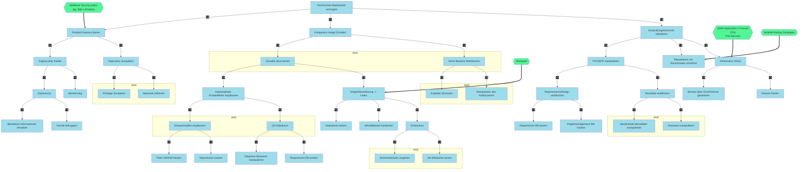

```mermaid
graph TD;
    Root[Technischen Marktvorteil verringern]

    B_Dev[Entwicklungsfortschritt sabotieren]
    B_Image[Kompetenz-Image Schaden]
    B_Product[Produkt-Features klauen]

    Root-- <span style='background-color:black'><span style='color:white'> X$ </span></span> -->B_Dev;
    Root-- <span style='background-color:black'><span style='color:white'> X$ </span></span> -->B_Image;
    Root-- <span style='background-color:black'><span style='color:white'> X$ </span></span> -->B_Product;

    subgraph conf_scand[AND]
        Image_conf[Keine Beweise hinterlassen]
        Image_scand[Skandal verursachen]
    end

    B_Image-- <span style='background-color:black'><span style='color:white'> X$ </span></span> -->Image_conf;
    B_Image-- <span style='background-color:black'><span style='color:white'> X$ </span></span> -->Image_scand;
    
    subgraph exp_audit[AND]
        conf_exp[Experten einsetzen]
        conf_audit[Manipulation des Auditsystems]
    end

    Image_conf-- <span style='background-color:black'><span style='color:white'> X$ </span></span> -->conf_audit;
    Image_conf-- <span style='background-color:black'><span style='color:white'> X$ </span></span> -->conf_exp;

    
    Scand_leak[Integritätsverletzung -> Leaks]
    Scand_vul[Katastrophale Produktfehler einpflanzen]

    Image_scand-- <span style='background-color:black'><span style='color:white'> X$ </span></span> -->Scand_leak;
    Image_scand-- <span style='background-color:black'><span style='color:white'> X$ </span></span> -->Scand_vul;

    Leak_break[Einbrechen]
    Leak_insider[Whistleblower bestechen]
    Leak_db[Datenbank hacken]

    Scand_leak-- <span style='background-color:black'><span style='color:white'> X$ </span></span> -->Leak_break;
    Scand_leak-- <span style='background-color:black'><span style='color:white'> X$ </span></span> -->Leak_insider;
    Scand_leak-- <span style='background-color:black'><span style='color:white'> X$ </span></span> -->Leak_db;

    subgraph cover_lock[AND]
        Break_cover[Als Mitarbeiter tarnen]
        Break_lock[Sicherheitstüren umgehen]
    end

    Leak_break-- <span style='background-color:black'><span style='color:white'> X$ </span></span> -->Break_cover;
    Leak_break-- <span style='background-color:black'><span style='color:white'> X$ </span></span> -->Break_lock;

    subgraph QA_Repo[AND]
        Vul_QA[QA Sabotieren]
        Vul_Plant[Schwachstellen einpflanzen]
    end

    Scand_vul-- <span style='background-color:black'><span style='color:white'> X$ </span></span> -->Vul_QA;
    Scand_vul-- <span style='background-color:black'><span style='color:white'> X$ </span></span> -->Vul_Plant;

    Plant_repo[Repositories hacken]
    Plant_flash[Flash-SW/HW hacken]

    Vul_Plant-- <span style='background-color:black'><span style='color:white'> X$ </span></span> -->Plant_repo;
    Vul_Plant-- <span style='background-color:black'><span style='color:white'> X$ </span></span> -->Plant_flash;

    QA_DB[Requirement DB hacken]
    QA_Sens[Diagnose-Sensoren manipulieren]

    Vul_QA-- <span style='background-color:black'><span style='color:white'> X$ </span></span> -->QA_DB;
    Vul_QA-- <span style='background-color:black'><span style='color:white'> X$ </span></span> -->QA_Sens;

    Product_Repo[Repository ausspähen]
    Product_Insider[Zugang über Insider]

    B_Product-- <span style='background-color:black'><span style='color:white'> X$ </span></span> -->Product_Repo;
    B_Product-- <span style='background-color:black'><span style='color:white'> X$ </span></span> -->Product_Insider;

    subgraph Net_auth[AND]
        Repo_network[Netzwerk infizieren]
        Repo_auth[Privilege Escalation]
    end

    Product_Repo-- <span style='background-color:black'><span style='color:white'> X$ </span></span> -->Repo_network;
    Product_Repo-- <span style='background-color:black'><span style='color:white'> X$ </span></span> -->Repo_auth;

    Insider_bribe[Bestechung]
    Insider_ransom[Erpressung]

    Product_Insider-- <span style='background-color:black'><span style='color:white'> X$ </span></span> -->Insider_bribe;
    Product_Insider-- <span style='background-color:black'><span style='color:white'> X$ </span></span> -->Insider_ransom;


    Ransom_kidnap[Familie kidnappen]
    Ransom_hack[Belastbare Informationen erhacken]

    Insider_ransom-- <span style='background-color:black'><span style='color:white'> X$ </span></span> -->Ransom_kidnap;
    Insider_ransom-- <span style='background-color:black'><span style='color:white'> X$ </span></span> -->Ransom_hack;

    Dev_DDoS[Infrastruktur DDoS]
    Dev_Ransom[Repositories mit Ransomware zerstören]
    Dev_PoC[PoC/MVP manipulieren]


    B_Dev-- <span style='background-color:black'><span style='color:white'> X$ </span></span> -->Dev_DDoS;
    B_Dev-- <span style='background-color:black'><span style='color:white'> X$ </span></span> -->Dev_Ransom;
    B_Dev-- <span style='background-color:black'><span style='color:white'> X$ </span></span> -->Dev_PoC;

    DDoS_buy[Botnetz kaufen]
    DDoS_virus[Botnetz über Viren/Würmer generieren]
    
    Dev_DDoS-- <span style='background-color:black'><span style='color:white'> X$ </span></span> -->DDoS_buy;
    Dev_DDoS-- <span style='background-color:black'><span style='color:white'> X$ </span></span> -->DDoS_virus;

    PoC_Experiment[Resultate verfälschen]
    PoC_Design[Requirements/Design verfälschen]

    Dev_PoC-- <span style='background-color:black'><span style='color:white'> X$ </span></span> -->PoC_Experiment;
    Dev_PoC-- <span style='background-color:black'><span style='color:white'> X$ </span></span> -->PoC_Design;

    Design_Proj[Projektmanagement SW hacken]
    Design_Reqs[Requirement DB hacken]

    PoC_Design-- <span style='background-color:black'><span style='color:white'> X$ </span></span> -->Design_Proj;
    PoC_Design-- <span style='background-color:black'><span style='color:white'> X$ </span></span> -->Design_Reqs;

    subgraph Sens_Dat[AND]
        Experiment_Sensor[Sensoren manipulieren]
        Experiment_Daten[Bestehende Messdaten manipulieren]
    end
    PoC_Experiment-- <span style='background-color:black'><span style='color:white'> X$ </span></span> -->Experiment_Sensor;
    PoC_Experiment-- <span style='background-color:black'><span style='color:white'> X$ </span></span> -->Experiment_Daten;

    DDoS_Prot{{"(Web-Application-) Firewall <br> CDN <br> Port Security"}} ==> Dev_DDoS
    
    Insider_Prot{{"Multilevel Security policy (eg. Bell-LaPadula)"}} ==> B_Product

    Ransom_Prot{{"Verteilte Backup Strategien"}} ==> Dev_Ransom

    DB_Prot{{"Honeypot"}} ==> Scand_leak

    classDef prot fill:#53f597;
    class DDoS_Prot prot;
    class Insider_Prot prot;
    class Ransom_Prot prot;
    class DB_Prot prot;

    classDef default fill:#9ddceb

```
<!-- classDef default fill:#white,stroke:#333,stroke-width:2px; -->
