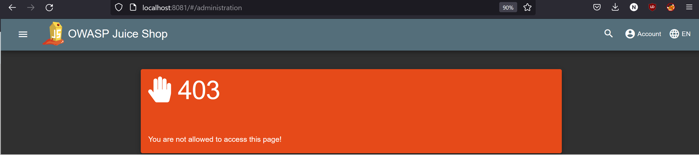
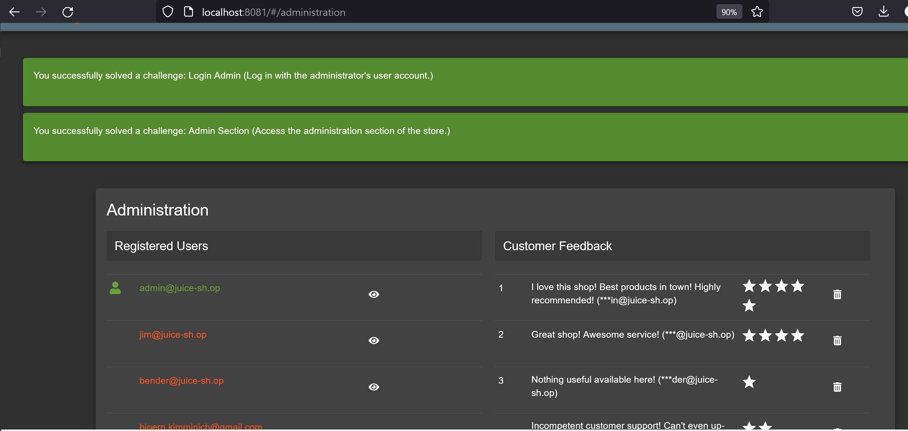

## Broken Admin Authentication and Access Control

A search in `main.js` reveals several endpoints such as `#/administration`. Accessing it without authorization yields a `403 Forbidden` error.

 To authenticate as admin we make us of an SQL injection in the login form:
- Select anything as password
- Use `' or 1=1--` ass email, logging in as the first user - the admin 

Optionally we can alter data accessible in the panel such as deleting all five-star reviews.

## Cross-Site Request Forgery

Login as victim (eg. wurstbrot@juice-sh.op) via `morty@juice-sh.op' --`.
